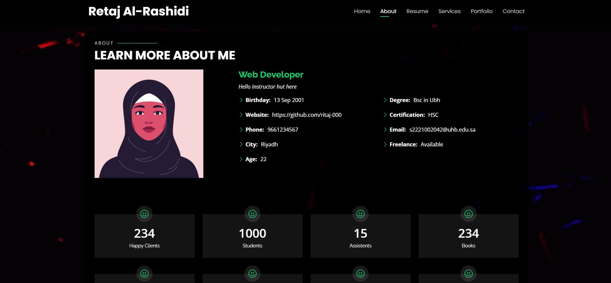

# Retaj Portfolio 🌟

A modern, responsive portfolio website showcasing Retaj's projects, skills, and professional experience. Built with pure HTML, CSS, and JavaScript With MySQL Database.

Live Demo: [https://ritaj-000.github.io/RetajPortfolio/](https://ritaj-000.github.io/RetajPortfolio/)

## Features ✨

- Responsive design for all screen sizes
- Interactive elements and smooth animations
- Project showcase with descriptions
- Skills section with visual indicators
- Contact form functionality
- Dark/light mode toggle
- Social media integration
- Clean and modern UI design

## Technologies Used 🛠️

- **HTML5** - Semantic markup
- **CSS3** - Custom animations and responsive design
- **JavaScript** - Interactive elements and form handling
- **Font Awesome** - Icons
- **Google Fonts** - Typography

## Installation 💻

1. Clone the repository:

git clone https://github.com/ritaj-000/RetajPortfolio.git

## Image Preview

#### Home Page

#### About Page

#### Resume Page

#### Service Page

#### Protfolio Page

#### Contact Page

